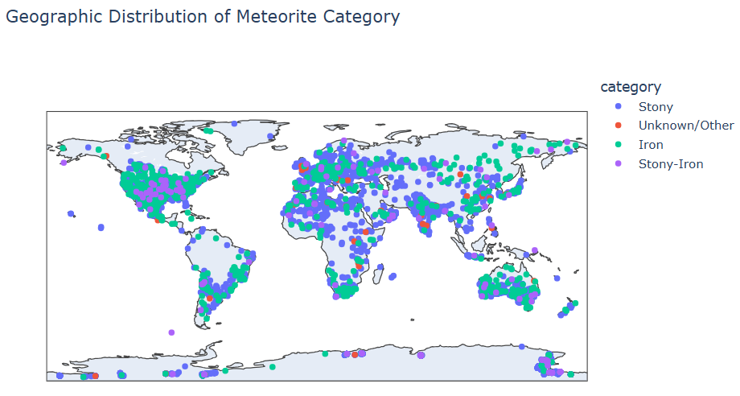

# Meteorite Analysis Project

## Project Summary

This project explores meteorite data to uncover insights about their landings, classifications, and geographical trends. By analyzing a comprehensive dataset from Kaggle, the project seeks to answer questions like: Which regions of the world have experienced the most meteorite landings? How does the geographical distribution of observed falls differ from that of found meteorites? Are there any geographical differences or differences over time in the class of meteorites that have fallen to Earth?
 
Using Python libraries such as Pandas, Seaborn, and Plotly, the data was cleaned, visualized, and analyzed to reveal meaningful patterns. Key findings:
* The distribution of meteorite landing is not uniform, and most of them fell in Anterctica.
* The distribution of observed meteorite impact locations roughly matches the population density map of the Earth.
* There is almost no differences over time in the class/category of meteorites that have fallen to Earth.

The project highlights the value of data analysis in understanding natural phenomena and showcases the power of Python for data exploration and visualization.

## Dataset

The dataset used for this project can be found on Kaggle: [Meteorite Landings dataset](https://www.kaggle.com/datasets/nasa/meteorite-landings).

The dataset is also available in this repository as `meteorite-landings.csv`.

## Most Impressive Graph
The graph shows the locations of the meteorite landings on world map (each point represent one location of meteorite) segmented to thier category: Stony meteorites, iron meteorites, stony-iron meteorites.
When we click on one category in the legend, we will only see the locations of meteorite landings that are from that category.

## DataCamp Testimonial

The skills I developed in DataCamp's 'Data Analyst with Python' career track, particularly in data manipulation with Pandas and visualization with Matplotlib and Plotly, provided essential expertise in Python, data analysis, and visualization, enabling me to clean the data, uncover key insights, and complete this project confidently.

